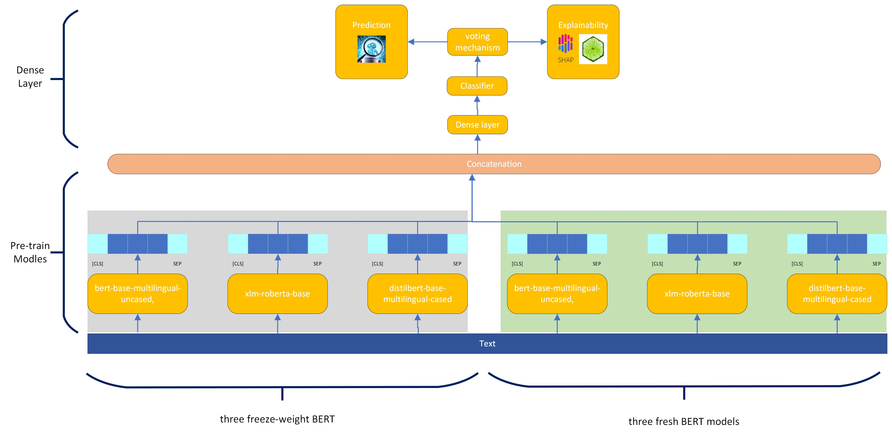
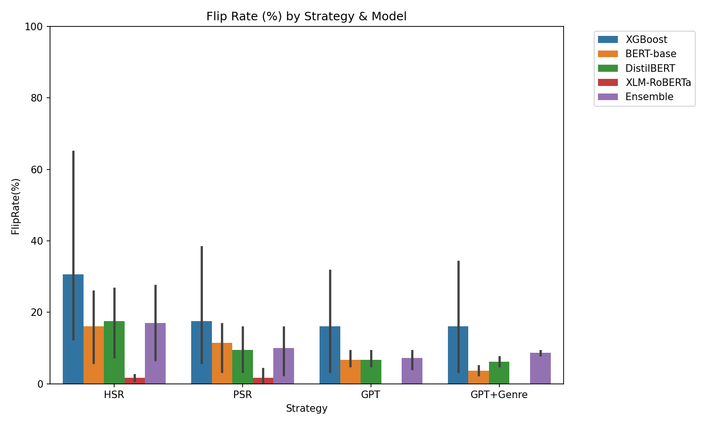

<div align="center">

# Token-Replacement

### Explainability-Based Token Replacement for AI-Generated Text Detection

[](https://www.jair.org/)
[](https://arxiv.org/abs/2506.04050)
[](LICENSE)
[](https://www.python.org/downloads/)

*Using explainability methods (SHAP, LIME) to both evade and improve AI-generated text detection*

[Paper](https://arxiv.org/abs/2506.04050) • [Code](https://github.com/mohammadi-hadi/Token-Replacement_code) • [Website](https://mohammadi.cv)

---

</div>

## Paper

| | |
|---|---|
| **Title** | Explainability-Based Token Replacement on LLM-Generated Text |
| **Authors** | Hadi Mohammadi, Anastasia Giachanou, Ayoub Bagheri |
| **Affiliation** | Utrecht University, The Netherlands |
| **Venue** | Journal of Artificial Intelligence Research (JAIR), 2025 |

## Overview

We investigate how explanation techniques can guide systematic token replacements that make AI-generated text less detectable, while also developing a robust ensemble detector that remains resilient against such adversarial strategies.

<div align="center">

<br><i>Pipeline overview: Explainability-guided token replacement</i>
</div>

### Key Findings

- **Token replacement strategies** (HSR, PSR, GPT, GPT+Genre) can reduce detection accuracy of individual models by 15-40%
- **Our ensemble detector** maintains 83% accuracy even against adversarial rewrites
- **Human evaluators** achieve only 47.0% detection accuracy on rewritten texts, showing humans are similarly vulnerable

<div align="center">

<br><i>Detection evasion rates across different scenarios and replacement strategies</i>
</div>

## Quick Start

```bash
# Clone the repository
git clone https://github.com/mohammadi-hadi/Token-Replacement.git
cd Token-Replacement

# Install dependencies
pip install -r requirements.txt

# Run sample analysis
python code/simple_analysis.py
```

## Repository Structure

```
├── Project03_JAIR_Revised/   # LaTeX source and figures
│   ├── main.tex              # Paper source
│   ├── main.bbl              # Compiled bibliography
│   ├── 01-sample-base.bib    # Bibliography database
│   ├── plots/                # Figures and visualizations
│   └── *.cls, *.bst          # LaTeX dependencies
│
├── code/                     # Analysis scripts
│   ├── human_eval_sample_selector.py
│   └── simple_analysis.py
│
├── data/                     # Datasets
│   ├── human_eval_samples.csv
│   ├── human_eval_texts_only.csv
│   └── strategy_results/
│
├── results/                  # Experimental results
│   ├── figures/              # Result visualizations
│   └── tables/               # Summary statistics
│
├── evaluation/               # Human evaluation materials
│   ├── human_eval_form.html
│   └── human_eval_results.json
│
├── Project03_JAIR_Revised_FINAL.pdf  # Compiled paper
├── response_letter.md        # Response to reviewers
└── overleaf.zip              # Overleaf project backup
```

## Building the Paper

```bash
cd Project03_JAIR_Revised
pdflatex main.tex
bibtex main
pdflatex main.tex
pdflatex main.tex
```

## Installation

```bash
git clone https://github.com/mohammadi-hadi/Token-Replacement.git
cd Token-Replacement
pip install -r requirements.txt
```

## Token Replacement Strategies

| Strategy | Description |
|----------|-------------|
| **HSR** | Human Similar Replacement - Word2Vec synonyms from human text |
| **PSR** | Part-of-Speech Replacement - HSR with POS tag matching |
| **GPT** | GPT-4o-mini prompted replacements |
| **GPT+Genre** | GPT with domain context (news, reviews, tweets) |

## Explainability Methods

- **SHAP**: Shapley values for global token importance
- **LIME**: Local perturbation-based importance scores
- **Random**: Baseline for comparison

## Human Evaluation

We conducted a human evaluation study with 100 text samples:
- 58 successfully evaded detection ("flipped")
- 15 original AI-generated texts
- 15 human-written controls
- 12 rewritten but still detected

Run the evaluation form: Open `evaluation/human_eval_form.html` in a browser.

## Citation

If you use this code or data, please cite:

```bibtex
@article{mohammadi2025explainability,
  title={Explainability-Based Token Replacement on LLM-Generated Text},
  author={Mohammadi, Hadi and others},
  journal={Journal of Artificial Intelligence Research},
  year={2025}
}
```

## License

MIT License - see [LICENSE](LICENSE) for details.

## Contact

- **Hadi Mohammadi** - Utrecht University
- Email: [h.mohammadi@uu.nl](mailto:h.mohammadi@uu.nl)
- Website: [mohammadi.cv](https://mohammadi.cv)
